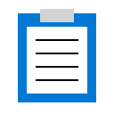
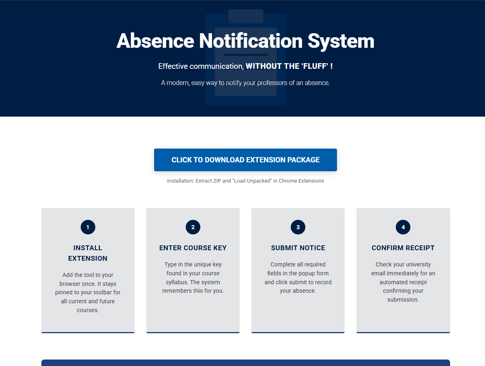
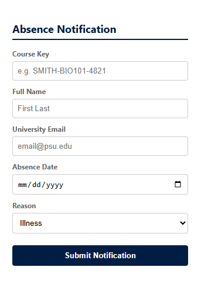
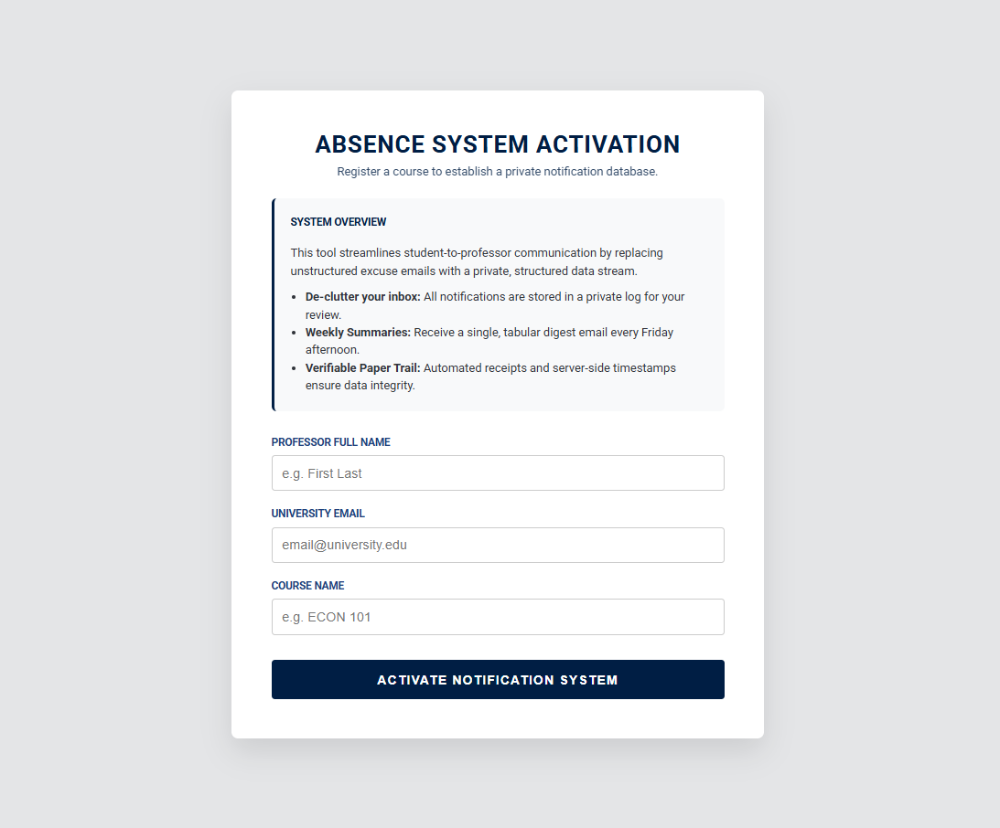
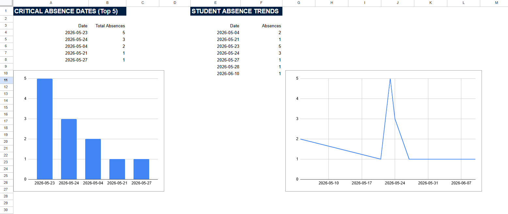
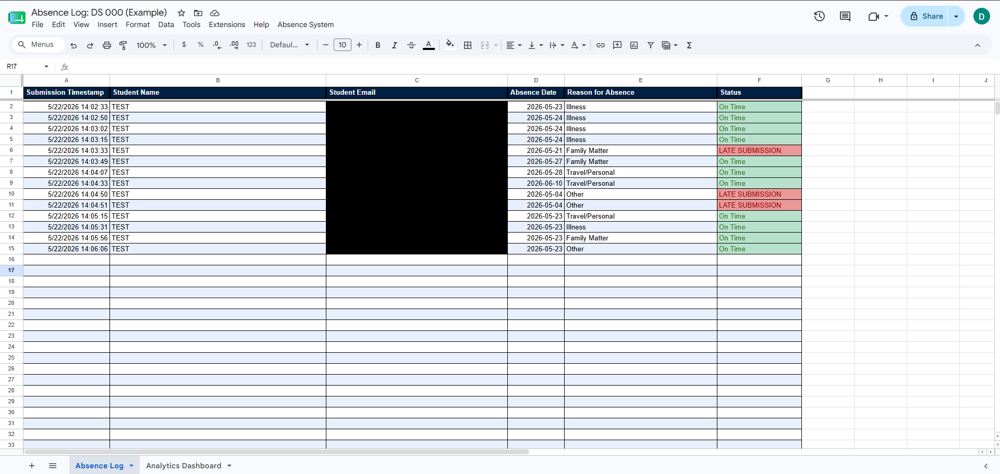
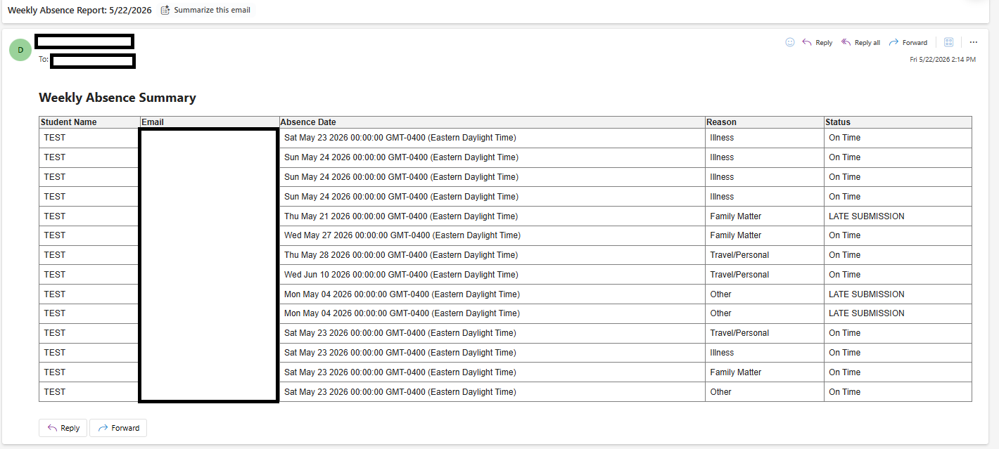

# Absence Notification System: Enterprise Relay Edition

## 🚀 The Vision
A scalable, multi-tenant academic communication system designed to replace unstructured absence emails with a professional data stream. Built for security, accessibility, and high-quality data acquisition.

---

## 📸 Visual Overview

### 1. Student Portal

*A modern, engaging landing page featuring institutional branding and clear 1-2-3 installation instructions.*

### 2. Chrome Extension UI

*A sleek, write-only interface featuring persistent storage (`chrome.storage`) and deep-linking support for syllabus integration.*

### 3. Professor Administration Portal

*A secure, passcode-gated hub for automated course provisioning and system activation.*

### 4. Analytics Dashboard

*An automated visual reporting suite for faculty, transforming raw logs into actionable insights via real-time data aggregation.*

### 5. Private Absence Log

*A structured, professor-owned database featuring automated formatting, and real-time status tracking.*

### 6. Automated Weekly Digest

*A professional summary email delivered every Friday, consolidating the week's data into a clean, actionable table.*

---

## 🔑 Engineering Highlights
- **Full-Stack Relay Architecture:** Engineered a central "Switchboard" (Google Apps Script) to route student data to private, professor-owned databases, ensuring total data isolation.
- **Automated SaaS Provisioning:** Developed an "Assembly Line" factory script that autonomously clones templates, manages permissions, and registers new courses.
- **Institutional Brand Alignment:** Implemented high-fidelity university brand standards, including exact HEX palettes, official typography (Roboto), and custom watermark branding.
- **Accessibility (WCAG 2.1 Level AA):** Prioritized inclusive design with high color contrast and screen-reader-optimized HTML structures.
- **Security-First Design:** Implemented server-side timestamp authority, authorization gating (access code verification), and structural interface isolation.

---

## 📊 Data Science & Analytical Integrity
As a Data Science-focused project, this system prioritizes **Data Integrity at the Source**:
- **Structured Acquisition:** Eliminates the hassle of unstructured emails by enforcing a standardized categorical schema at ingestion.
- **Automated Aggregation:** Uses Google Query Language (GQL) to perform real-time SQL-like operations, identifying key dates and attendance trends.
- **Analytical Robustness:** Implements immutable server-side logic to ensure visual accuracy and prevent client-side data manipulation.

---

## 🏗️ System Architecture
1. **Frontend:** Chrome Extension with persistent memory.
2. **Switchboard:** Master Gateway (Google Apps Script) for intelligent routing and security.
3. **Automation:** "The Factory" logic for seamless institutional scaling.
4. **Backend:** Multi-tenant Google Sheets with automated Friday Digest triggers and visual dashboards.

---

## 🔒 Security & Privacy
This project includes a comprehensive **Security & Robustness Manifesto** detailing our defense against common vulnerabilities and commitment to student privacy.

[Read the Full Security Manifesto](SECURITY_AND_ROBUSTNESS.md)

---
**💼 Portfolio Note:** *This repository has been sanitized for security purposes. Production API URLs, Spreadsheet IDs, and System Passcodes have been replaced with `[REDACTED]` placeholders to protect the live university instance while showcasing full architectural logic.*

---
**Built with logic, math, and a commitment to academic excellence.**
